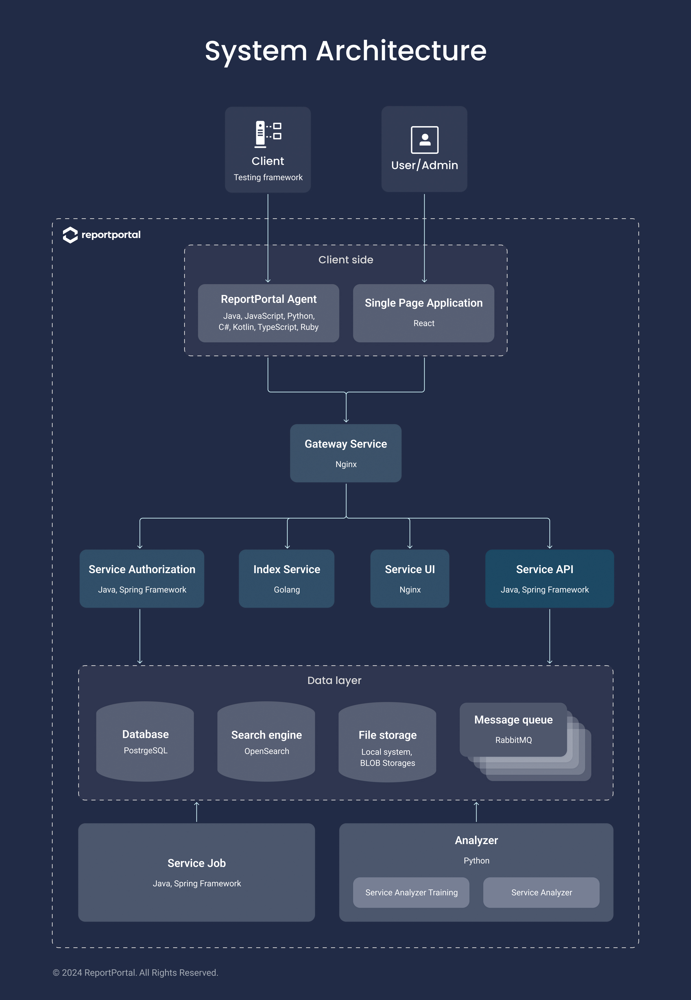

# [ReportPortal.io](http://ReportPortal.io)

[](https://slack.epmrpp.reportportal.io/)
[](http://stackoverflow.com/questions/tagged/reportportal)
[](https://reportportal.io/community)
[](https://hub.docker.com/u/reportportal/)
[](https://www.apache.org/licenses/LICENSE-2.0)
[](http://reportportal.io?style=flat)
[](https://www.lambdatest.com/)

- [ReportPortal.io](#reportportalio)
  - [Repositories structure](#repositories-structure)
    - [ReportPortal high level architecture](#reportportal-high-level-architecture)
    - [ReportPortal repositories structure](#reportportal-repositories-structure)
  - [Installation steps](#installation-steps)
    - [Simple setup with Docker](#simple-setup-with-docker)
    - [Production-ready set and Custom deployment with Docker](#production-ready-set-and-custom-deployment-with-docker)
  - [Integration. How to get log data in](#integration-how-to-get-log-data-in)
  - [Contribution](#contribution)
  - [Documentation](#documentation)
  - [Community / Support](#community--support)
  - [License](#license)

## Repositories structure

### ReportPortal high level architecture



### ReportPortal repositories structure

Report Portal organized into multiple repositories.

ReportPortal **server side** consists of the following services:

- [`service-authorization`](https://github.com/reportportal/service-authorization) Authorization Service. In charge of access tokens distribution
- [`service-api`](https://github.com/reportportal/service-api) API Service. Application Backend
- [`service-ui`](https://github.com/reportportal/service-ui) UI Service. Application Frontend
- [`service-index`](https://github.com/reportportal/service-index) Index Service. Info and health checks per service.
- [`service-analyzer`](https://github.com/reportportal/service-auto-analyzer) Analyzer Service. Finds most relevant test fail problem.
- [`gateway`](https://github.com/containous/traefik) Traefik Gateway Service. Main entry point to application. Port used by gateway should be opened and accessible from outside network.
- [`rabbitmq`](https://github.com/rabbitmq) Load balancer for client requests. Bus for messages between servers.
- [`minio`](https://github.com/minio/minio) Attachments storage.

Available plugins developed by ReportPortal team:

- [`plugin-bts-jira`](https://github.com/reportportal/plugin-bts-jira) JIRA Plugin. Interaction with JIRA. [Link to download](https://search.maven.org/search?q=g:%22com.epam.reportportal%22%20AND%20a:%22plugin-bts-jira%22)
- [`plugin-bts-rally`](https://github.com/reportportal/plugin-bts-rally) Rally Plugin. Interaction with Rally. [Link to download](https://search.maven.org/search?q=g:%22com.epam.reportportal%22%20AND%20a:%22plugin-bts-rally%22)
- [`plugin-saucelabs`](https://github.com/reportportal/plugin-saucelabs) Sauce Labs Plugin. Interaction with Sauce Labs. [Link to download](https://search.maven.org/search?q=g:%22com.epam.reportportal%22%20AND%20a:%22plugin-saucelabs%22)

**Client side** adapters related repositories:

- [`client-*`](https://github.com/reportportal?utf8=%E2%9C%93&q=client-) - API integrations. Http clients, which process HTTP request sending.
- [`agent-*`](https://github.com/reportportal?utf8=%E2%9C%93&q=agent-) - Frameworks integration. Custom reporters/listeners, which monitor test events and trigger event sending via [`client-*`](https://github.com/reportportal?utf8=%E2%9C%93&q=client-)
- [`logger-*`](https://github.com/reportportal?utf8=%E2%9C%93&q=logger-) - Logging integration. Logger appenders, which help to collect logs, bind it with test-case item via `agent-*` and send to server via `client-*`

**Other repositories** stored according to next rules

- [`service-*`](https://github.com/reportportal?utf8=%E2%9C%93&q=service-) - micro-services which are a part of Application
- [`commons-*`](https://github.com/reportportal?utf8=%E2%9C%93&q=commons-) - common libraries, models, etc., used by micro-services

## Installation steps

### Simple setup with Docker

It's the best way for demo purposes and small teams. The database is already in the docker-compose.

1. Install [Docker](https://docs.docker.com/engine/installation/) ([Engine](https://docs.docker.com/engine/installation/), [Compose](https://docs.docker.com/compose/install/))

2. Download [Example of docker-compose descriptor](https://github.com/reportportal/reportportal/blob/master/docker-compose.yml) to any folder

3. Deploy ReportPortal using `docker compose plugin` within the same folder

```bash
docker compose -p reportportal up
```

To start ReportPortal in daemon mode, add '-d' argument:

```bash
docker compose -p reportportal up -d
```

4. Open in your browser IP address of deployed environment at port `8080`

```uri
http://IP_ADDRESS:8080
```

5. Use next login\pass for access:

- `default\1q2w3e`
- `superadmin\erebus`.

>Please change admin password for security.
>
>Mentioned compose file deploy all available Bug Tracking System integrations, which not always needed, but use resources.

### Production-ready set and Custom deployment with Docker

For production usage, we recommend:

- choose only required Bug Tracking System integration service. Exclude the rest

To customize deployment and make it production-ready please follow [customization steps and details](https://github.com/reportportal/reportportal/wiki/Production-Ready-set-and-Deployment-Customization)

## Integration. How to get log data in

You should add **Client Side** code inside your test automation. It consists of:

- [`client-*`](https://github.com/reportportal?utf8=%E2%9C%93&q=client-) - API integrations. Http clients, which process HTTP request sending. E.g. for Java ([`client-java-*`](https://github.com/reportportal?utf8=%E2%9C%93&q=client-java-))
- [`agent-*`](https://github.com/reportportal?utf8=%E2%9C%93&q=agent-) - Frameworks integration. Custom reporters/listeners, which monitor test events and trigger event sending via [`client-*`](https://github.com/reportportal?utf8=%E2%9C%93&q=client-)
- [`logger-*`](https://github.com/reportportal?utf8=%E2%9C%93&q=logger-) - Logging integration. Logger appenders, which helps to collect logs, bind it with test-case via `agent-*` and send to server via `client-*`

[Integration steps and documentation](http://reportportal.io/#documentation/%EF%BB%BFTest-framework-integration)

## Contribution

There are many different ways to contribute to Report Portal's development, just find the one that best fits with your skills. Examples of contributions we would love to receive include:

- **Code patches**
- **Documentation improvements**
- **Translations**
- **Bug reports**
- **Patch reviews**
- **UI enhancements**

Big features are also welcome but if you want to see your contributions included in Report Portal codebase we strongly recommend you start by initiating a [chat through our Team in Slack](https://slack.epmrpp.reportportal.io/).

[Contribution details](https://github.com/reportportal/reportportal/wiki/Contribution)

## Documentation

- [User Manual](http://reportportal.io/#documentation)
- [Wiki and Guides](https://github.com/reportportal/reportportal/wiki)

## Community / Support

- [Slack chat](https://slack.epmrpp.reportportal.io/)
- [Security Advisories](https://github.com/reportportal/reportportal/blob/master/SECURITY_ADVISORIES.md)
- [GitHub Issues](https://github.com/reportportal/reportportal/issues)
- [Stackoverflow Questions](http://stackoverflow.com/questions/tagged/reportportal)
- [Twitter](http://twitter.com/ReportPortal_io)
- [YouTube Channel](https://www.youtube.com/channel/UCsZxrHqLHPJcrkcgIGRG-cQ)

## License

Report Portal is [Apache 2.0](https://www.apache.org/licenses/LICENSE-2.0).
