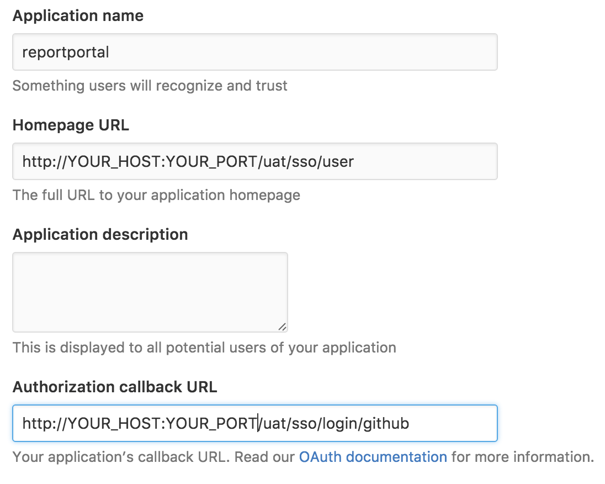
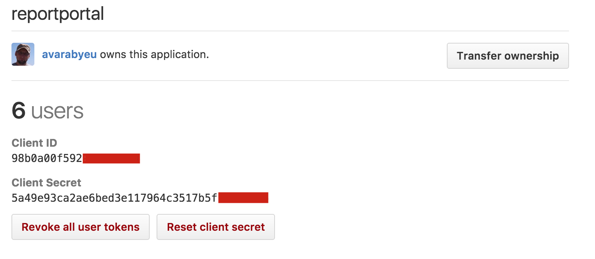

## How to configure login via GitHub
ReportPortal allows logging in via GitHub OAuth Web Application Flow.
To enable this feature you need to [register new application in Github](https://github.com/settings/applications/new)

Here is example configuration. Just replace 'YOUR_HOST' and 'YOUR_PORT' with appropriate values:


Once new application is created, you will have client ID and client secret.



This two values should be provided to authorization service of ReportPortal. The best option to do that is to use environment variables. Thus, docker-compose block for authorization service will like that:

```yaml
uat:
    image: reportportal/service-authorization
    depends_on:
      - redis
      - mongodb
      - registry
    environment:
      - reportportal.config.server.host=registry
      - SPRING_PROFILES_ACTIVE=docker
      - github.client.clientId=YOUR_CLIENT_ID
      - github.client.clientSecret=YOUR_CLIENT_SECRECT
    restart: always
```
